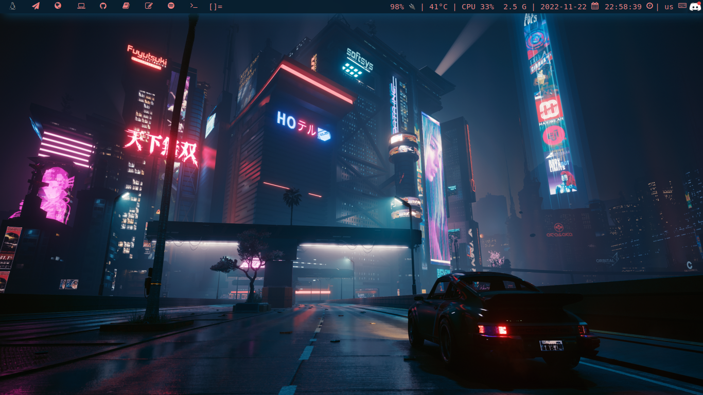
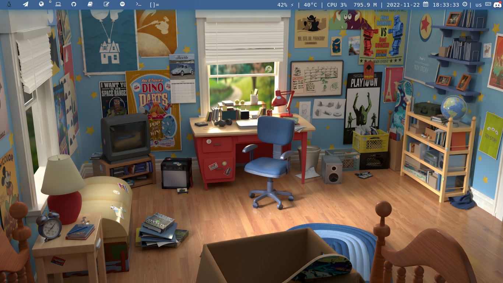

# ⁩ 0x73hahd's dwm ♡⁩

This repo for DWM configuration, it's contains different themes to switch between them.

## Tokyo DWM Theme
A dark theme for DWM 🌃🌆




## Toy Story DWM Theme
A dwm theme that I create reminds me of my childhood days 🙃❤




---

#### Themes Switching:

1. Change the current `color.h` file in `config.h`
```c
    #include "colors/<NAME_OF_COLOR_DOT_H_FILE>"
```

2. Replace `alacritty.yml` and `picom.conf` theme file with previous files

```
 $ mv <NAME_OF_THEME>/alacritty.yml ~/.config/alacritty/alacritty.yml 
```

```
 $ mv <NAME_OF_THEME>/picom.conf ~/.config/picom/picom.conf
```

