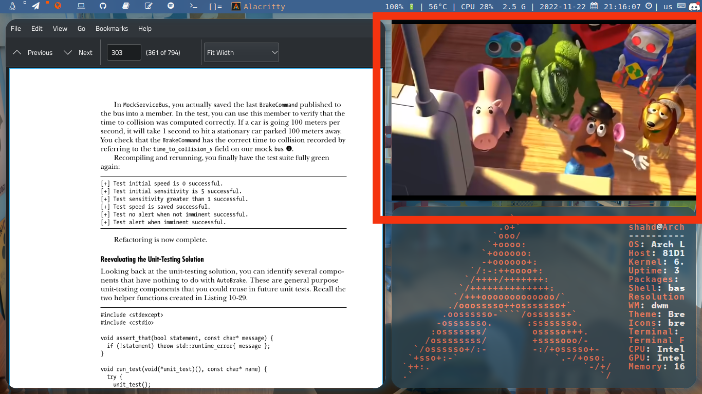
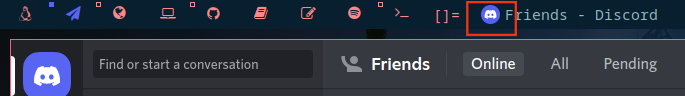

## patches that I used on dwm

### [autosart](https://dwm.suckless.org/patches/autostart/)
  This patch allows programs to autostart when you login to dwm.
  you can create autostart.sh file on the following directories:
  1. $HOME/.dwm
  2. $HOME/.local/share/dwm
  3. $XDG_DATA_HOME/dwm

### [alwayscenter](https://dwm.suckless.org/patches/alwayscenter/)
  This patch make all floating windows are centered.

### [bar-height-spacing](https://dwm.suckless.org/patches/bar_height/)
  This patch allows you to change dwm's default bar height.
  ```c
  static const int user_bh = 0;
  ```
### [fakefullscreen](https://dwm.suckless.org/patches/fakefullscreen/)
  This patch enables fullscreen on a small secondary screen while having other windows.

  

### [fullgabs](https://dwm.suckless.org/patches/fullgaps/)
  This patch adds gaps between client windows.
  ```c
  static const unsigned int gappx = 5; /* gaps between windows */
  ```

### [keychain](https://dwm.suckless.org/patches/keychain/)
  This patch allows you to chain multiple key bindings together. for example Mod+a+t to open alacritty terminal.
  ```c
  static const Key keys[] = {
/* modifier   chain key   key   function   argument */
  { MODKEY,     XK_a,       XK_t, spawn,     SHCMD("alacritty") },
  }
  ```
### [movestack](https://dwm.suckless.org/patches/movestack/)
This patch allows you to move clients around in the stack and swap them with the main window by include movestack.c source file and add keys for swapping.
  ```c
  #include "movestack.c"
  static const Key keys[] = {
	    { ShiftMask,     -1,      XK_x,      movestack,      {.i = +1 } },
	    { ShiftMask,     -1,      XK_z,      movestack,      {.i = -1 } },
  }
  ```

### [pertag](https://dwm.suckless.org/patches/pertag/)
  This patch keeps layout, mwfact, barpos and nmaster per tag.

###  [raimbowtags](https://dwm.suckless.org/patches/rainbowtags/)
  Allows each tag to be an independent colour when selected.
  ```c
  static const char tag1[]            = "#939393";
  static const char tag2[]            = "#5865F2";
  static const char tag3[]            = "#FF5500";
  static const char tag4[]            = "#FF609A";
  static const char tag5[]            = "#842291";
  static const char tag6[]            = "#900C3F";
  static const char tag7[]            = "#67AFA5";
  static const char tag8[]            = "#1DB954";
  static const char tag9[]            = "#FFFFFF";
  
  static const char *tagsel[][2] = {
	{   tag1, col_gray1   },
	{   tag2, col_gray1   },
	{   tag3, col_gray1   },
	{   tag4, col_gray1   },
	{   tag5, col_gray1   },
	{   tag6, col_gray1   },
	{   tag7, col_gray1   },
	{   tag8, col_gray1   },
	{   tag9, col_gray1   },
};
  ```

###  [resarting](https://dwm.suckless.org/patches/restartsig/)
  This patch allows you to restart dwm.

###  [status2d-systray](https://dwm.suckless.org/patches/status2d/)
  This patch allows colors in your dwm status bar with system tray implementation.
  
###  [titlecolor](https://dwm.suckless.org/patches/titlecolor/)
  This patch adds a new color scheme used by the window title in the bar.
  ```c
  static const char *colors[][3]      = {
    [SchemeTitle]  = { col_gray4, col_cyan,  col_cyan  },
  }
  ```

### [urg-border](https://dwm.suckless.org/patches/urgentborder/)
  This patch makes borders of urgent windows a different color.
  
  ```c
  static const char col_urgborder[]   = "#ff0000";
  static const char *colors[][3]      = {
    [SchemeUrg]  = { col_gray4, col_cyan,  col_urgborder  },
  }
  ```

###  [winicon](https://dwm.suckless.org/patches/winicon/)
  This patch enables dwm to show window icons.
   
  
